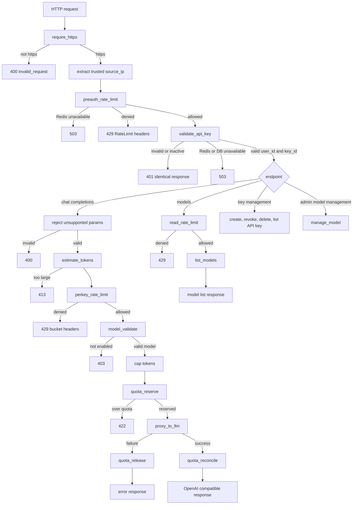

# API Requirements

## Flow Overview

## Implementation Order

Implement the functions in this order. Each phase supplies a dependency for the next phase.

1. **Runtime and shared primitives**

- Configure trusted proxy headers, UTC time, Asia/Bangkok `Today`, Redis timeouts, and the database session.
- Define constants and validators for ULID, base62 secrets, token bounds, policy caps, and the common error/response envelope.
- Add Redis Lua helpers for atomic operations, timeout handling, and fail-closed behavior.

2. **Request boundary and authentication**

- `require_https`
- Trusted `source_ip` extraction
- `preauth_rate_limit`
- `validate_api_key`
- Authentication cache, negative cache, constant-time hash comparison, and throttled `last_used_at` update.

3. **Rate limits and model lookup**

- `estimate_tokens`
- `perkey_rate_limit`
- `read_rate_limit`
- `model_validate`
- `list_models`

4. **Quota lifecycle**

- `quota_reserve`
- `quota_reconcile`
- `quota_release`
- Quota schema health check and usage/provider metadata logging.

5. **Provider boundary**

- Provider credential loading and model status re-check.
- `proxy_to_llm`
- Message/usage validation, concurrency limit, timeout handling, idempotency, and provider error mapping.

6. **Endpoint orchestration**

- Chat flow: HTTPS -> pre-auth limit -> API key -> parameter validation -> estimate -> per-key limit -> model -> quota -> provider -> reconcile/release.
- Models flow: HTTPS -> pre-auth limit -> API key -> read limit -> list models.

7. **API key management**

- `create_api_key`
- `revoke_api_key`
- `delete_api_key`
- `list_api_keys`

8. **Admin and operational paths**

- `manage_model`
- Async auth failure audit and alert aggregation.
- Periodic quota health check and provider metrics.

## require_https

`require_https(request) -> pass | 400`

- middleware ตัวแรกสุด ก่อน preauth_rate_limit
- proto = request.header["X-Forwarded-Proto"]
  - ต้องมาจาก trusted proxy ที่เขียนทับ header เสมอ
  - ถ้า proxy ไม่เขียนทับ การตรวจนี้ปลอมได้
- if proto != "https" -> 400 immediately
- ห้าม redirect (request แรกพา key ไป plaintext แล้ว)
- ห้าม log header ใด ๆ ของ request นี้
- response: {"error": {"type": "invalid_request",
  "message": "HTTPS is required. Update your client to use https://"}}

## Pre-auth Rate Limit

`preauth_rate_limit(ip) -> {allowed, remaining, reset}`

- ip มาจาก header ที่ trusted proxy เขียนทับเท่านั้น
  - ห้ามอ่าน X-Forwarded-For ตัวแรก (client กำหนดได้)
  - ใช้ X-Real-IP ถ้า nginx ตั้ง proxy_set_header ให้
  - ถ้าต้องใช้ XFF -> อ่านตัวขวาสุดหลัง trusted proxy hop
  - ห้าม key ด้วยค่าอื่นจาก request (User-Agent, custom header)
- bucket key: rl:ip:{ip}
- run token bucket lua (atomic)
  - refill by redis TIME, not app clock
  - cap 60 / refill 1 per sec / ttl 300
  - cap รอคำตอบเรื่อง NAT — ถ้าออกทาง IP เดียว ต้องตั้งสูงกว่านี้มาก
- redis down -> fail closed, 503
- deny -> 429 + RateLimit-* headers

## Validate API Key

`validate_api_key(token, source_ip) -> {user_id, key_id} | 401`

- parse: mthw01_{key_id}_{secret}
  - wrong prefix or shape -> 401
  - key_id ต้องเป็น ULID ถูกรูป (26 ตัว, Crockford base32)
  - secret ต้องยาว 32 ตัว base62
  - ผิดรูป -> 401 ทันที ไม่แตะ redis ไม่แตะ db
- check negative cache: auth:neg:{key_id} -> 401
- hash = sha256(secret)
  - SHA-256 ไม่ใช่ bcrypt/argon2
    - secret มี entropy 190 bits จาก CSPRNG ไม่ใช่รหัสผ่าน
    - bcrypt ออกแบบให้ช้าเพื่อชดเชย entropy ต่ำ
    - ที่นี่ทำทุก request จึงรับต้นทุนนั้นไม่ได้
- raw token/secret ไม่ออกจาก scope ของฟังก์ชันนี้
  - ห้ามเก็บใน struct/object ที่ส่งต่อไป layer อื่น
  - ห้ามวางในตัวแปรที่อาจถูก serialize ลง error trace
- check auth cache: auth:{key_id}
  - cached value = {user_id, key_hash, status}
  - hit -> constant-time compare hash, check status
  - miss -> query db by key_id (db timeout 2s)
- db unavailable -> 503 ไม่ใช่ 401
  - 401 จะทำให้ผู้ใช้เข้าใจผิดว่า key ตัวเองเสีย
- db miss -> set auth:neg:{key_id} ttl 30 -> 401
  - cache เฉพาะ key_id ไม่มีจริง ไม่ cache กรณี hash ผิด
  - ttl 30 ไม่สั้นกว่า auth cache มากเกินไป (ลด timing gap)
  - หมายเหตุ: กันได้เฉพาะการยิงซ้ำ key เดิม
    ถ้ายิงด้วย key_id สุ่มไม่ซ้ำ ตัวที่กันคือ preauth_rate_limit
- constant-time compare hash
- status must be "active" (single source of truth, not revoked_at)
- user_id from key record only, never from request
  - ห้ามมี default user_id ทุกกรณี
  - cached value ไม่มี user_id -> ถือเป็น miss
- fill cache auth:{key_id} ttl 60
  - = worst-case exposure window หลัง revoke ถ้า invalidate พลาด
- on success -> update last_used_at (throttled 5 min)
  - คืน token กลับเข้า rl:ip:{ip}
  - IP bucket จึงนับเฉพาะ request ที่ล้มเหลว
  - ผู้ใช้ที่ตั้งค่า key ผิดชั่วคราวไม่ถูกกันหลังแก้ถูกแล้ว
- on failure -> audit: auth.failed (key_id, source_ip, reason) async
  - reason เก็บฝั่ง server เท่านั้น ไม่ส่งกลับให้ผู้เรียก
  - aggregate record ที่ซ้ำกัน (key_id + ip เดิม)
  - alert เมื่อ failure rate สูงผิดปกติจาก ip เดียว
- log ใช้ key_id เท่านั้น ห้าม log token/secret ทุกกรณี
- redis down -> 503, never fail open
  - Redis เป็น hard dependency ของ feature นี้
  - การถอยไป query db ทุก request จะทำให้ db ที่ใช้ร่วมกับ
    แอปหลักรับภาระเกิน กลายเป็นขยายผลกระทบไปสู่ระบบหลัก
- all failures return identical 401
  - เหมือนกันทั้ง status, body, header
  - ห้ามมี WWW-Authenticate ที่บอกเหตุผลต่างกัน
  - ห้ามมี error code ย่อยใน body

## Per-API-Key Rate Limit

`perkey_rate_limit(user_id, est_tokens) -> {allowed, remaining, reset, limit_type}`

- user_id มาจาก validate_api_key เท่านั้น
  - ห้ามอ่านจาก request/header ทุกกรณี
- est_tokens = estimate_tokens(messages) + cap_tokens
  - ประมาณจากจำนวนตัวอักษร ไม่ต้องใช้ tokenizer จริง
  - ใช้เฉพาะ rate limit — quota reconcile ใช้ค่าจริงจาก provider
- est_tokens > MAX_INPUT_TOKENS -> 413 ก่อนแตะ bucket
- lua script เดียว รับ 2 KEYS ตรวจทั้งคู่ก่อนหัก ← เปลี่ยน
  - rl:key:{user_id} request count, cost 1
  - rl:tok:{user_id} llm token volume, cost est_tokens
  - ผ่านทั้งคู่ -> หักทั้งคู่
  - ตัวใดตัวหนึ่งไม่ผ่าน -> ไม่หักเลย + คืน limit_type ← เพิ่ม
- limit_type บอกว่า bucket ไหนปฏิเสธ (request | token)
- redis down -> fail closed, 503
- deny -> 429 + RateLimit-* headers
  - header แยกชุดตาม bucket ที่ปฏิเสธ

## Chat

`POST /v1/chat/completions` ← path เปลี่ยน

`func chat(key, model, messages, params) -> response`

0. require_https -> 400
1. preauth_rate_limit(ip) -> 429
2. validate_api_key(key) -> 401
   -> {user_id, key_id}
3. reject unsupported params -> 400 ← เพิ่ม
   - stream=true, tools, functions, n>1
   - ปฏิเสธชัด ๆ ไม่ใช่ ignore
     stream ที่ถูก ignore จะทำให้ SDK รอ chunk ที่ไม่มีวันมา
4. est = estimate_tokens(messages) + cap_tokens ← เพิ่ม
   - คำนวณที่นี่ ส่งต่อให้ทั้ง step 5 และ 8
5. perkey_rate_limit(user_id, est) -> 429
6. model_validate(model) -> 403
   -> {model_id, max_tokens}
7. cap = min(req.max_tokens, model.max_tokens, POLICY_CAP)
8. resv_id = quota_reserve(user_id, est) -> 422
9. proxy_to_llm(model_id, messages, cap, req_id, resv_id)
   - on success -> quota_reconcile(resv_id, actual)
   - on failure -> quota_release(resv_id)
10. return OpenAI-compatible response ← เปลี่ยน
    - choices array ไม่ใช่ message เดี่ยว
    - created เป็น unix timestamp
    - headers: RateLimit-_, X-RateLimit-Tokens-_, X-Request-Id

## Model Validation

`model_validate(model_name) -> {model_id, max_tokens} | 403`

- normalize: trim whitespace
- exact match เท่านั้น ห้าม prefix/substring/fuzzy match
- HGET model:enabled {model_name}
  - hit -> parse and return
  - miss -> query db
    SELECT id, max_tokens, status FROM model WHERE name = $1
    if not found or status != 'enabled' -> 403
    HSET model:enabled ttl 300
    return
- redis down -> query db directly (cheap, low volume)
- model field ไม่มีมา -> 400 ห้ามใช้ DEFAULT_MODEL
- คืน model_id ไม่ใช่ model_name ให้ขั้นถัดไป
  - proxy_to_llm รับ model_id -> ไม่ต้องตรวจซ้ำ
- caller ใช้ max_tokens เป็นเพดาน:
  cap = min(request.max_tokens, model.max_tokens, POLICY_CAP)

  ## Quota Check

  `quota_reserve(user_id, est_tokens) -> {ok, resv_id} | 422`

- lua atomic:
  now = redis TIME
  ZREMRANGEBYSCORE api:quota:resv:{user_id} -inf (now-300)
  resv = sum(est ที่ parse จาก ZRANGE api:quota:resv:{user_id})
  limit = HGET quota:{user_id} limit
  ไม่มี -> ใช้ default จาก ARGV
  used = HGET quota:{user_id} used (from main app)
  ค่าที่อ่านมาต้องเป็นตัวเลขจำนวนเต็มไม่ติดลบ  
  ผิดรูป -> 503 + alert (schema ของแอปหลักเปลี่ยน)
  if used + resv + est > limit -> reject 422
  ZADD api:quota:resv:{user_id} now "{req_id}:{est}"
  EXPIRE api:quota:resv:{user_id} 600
  return req_id
- redis/quota store ไม่พร้อมใช้งาน -> 503 fail closed
  - timeout 2s ไม่ปล่อยค้าง
  - ปลายทางมีต้นทุนจริง การปล่อยผ่านแย่กว่าการปฏิเสธ
  - สอดคล้องกับ fail mode ของทั้งเชน
- ไม่มี field reserved -> ไม่ต้องขอทีมแอปหลัก
- ยอดจองคำนวณสดจากรายการที่ยังไม่หมดอายุ -> ไม่มีอะไรค้าง
- 300s ต้องมากกว่า read timeout อย่างน้อย 2 เท่า
- 422 ไม่บอกยอดคงเหลือ บอกแค่ว่าไม่ผ่าน

### quota_reconcile

`quota_reconcile(resv_id, actual_tokens)`

- lua atomic:
  หา member ที่ขึ้นต้นด้วย {req_id} ใน api:quota:resv:{user_id}
  ไม่มี -> หมดอายุแล้ว, log แล้วจบ
  ZREM api:quota:resv:{user_id} member
  HINCRBY quota:{user_id} used +actual
  HINCRBY เป็น atomic ฝั่งเรา  
  แต่ atomic ข้ามระบบต้องให้แอปหลักใช้ HINCRBY ด้วย
  ถ้าเขาใช้ SET จะทับยอดของเราหาย -> ต้องยืนยันกับทีม
- actual ต้องผ่าน validate usage จาก proxy_to_llm แล้ว
- เขียน usage_log async:
  source='api', user_id, key_id, amount=actual,
  request_id, timestamp
  - ไม่เก็บ source_ip, prompt content, model
  - ตารางแยกจาก audit_log (ปริมาณต่างกันมาก)
  - retention 60 วัน

### quota_release

`quota_release(resv_id)`

- lua atomic:
  ZREM api:quota:resv:{user_id} member
  ไม่มี -> จบ (idempotent)
- เรียกจากทุก failure path ผ่าน finally/defer
- ไม่เขียน usage_log (ไม่ได้หักจริง)

### health check (รันเป็นรอบ)

- อ่าน quota:{user_id} ของ account ทดสอบ
- ตรวจว่า key ยังมีอยู่ และ limit/used ยังเป็นตัวเลข
- ผิดรูป -> alert ทันที
- กัน schema ของแอปหลักเปลี่ยนแล้วเรารู้ตอน production พัง

## LLM

`proxy_to_llm(model_id, messages, cap_tokens, request_id, resv_id, idem_key?) -> {content, usage} | error`

- model_id / resv_id เป็นหลักฐานว่าผ่าน validate + quota แล้ว
  - ประกอบเองไม่ได้ -> เส้นทางที่ข้าม chain เรียกไม่ได้
  - model_id พิสูจน์ว่าเคย lookup สำเร็จ ไม่ได้พิสูจน์ว่ายัง enabled
    - resolve model record จาก model_id ก่อนประกอบ payload
    - status != 'enabled' -> 403
    - ปิดช่วงเวลาระหว่าง validate กับการเรียกจริง
- max concurrent outbound 50 -> เกินแล้ว 503 ทันที
- idempotency (ถ้ามี idem_key):
  - GET idem:{key_id}:{idem_key}
    - hit + payload hash ตรง -> คืน response เดิม ไม่เรียก provider
    - hit + payload hash ต่าง -> 400
    - miss -> เรียกต่อ
- validate messages[].role: system | user | assistant
  - ค่าอื่น -> 400
  - อนุญาต system เพราะ RAG ต้องใช้
- enforce local bounds ก่อนประกอบ payload:
  - cap_tokens = min(cap_tokens, POLICY_CAP)
  - est_input = estimate_tokens(messages)
  - est_input > MAX_INPUT_TOKENS -> 413
  - est_input + cap_tokens > model.context_window -> 400
  - ห้ามส่ง parameter ใดที่ caller กำหนดโดยไม่ผ่าน bound check
- ประกอบ payload เป็น structured object
  - ห้าม string interpolation ของ user input
  - feature นี้ไม่เติม system instruction เอง
- provider credential:
  - โหลดจาก secret store ตอน runtime ไม่ hard-code
  - ไม่เก็บใน global variable ที่ dump ได้
  - ไม่ออกจาก scope ที่ประกอบ HTTP request
  - แยก credential ระหว่าง dev / staging / production
  - รองรับการหมุนเวียนโดยไม่ต้อง restart
- content handling:
  - messages / response ไม่ออกจาก scope ของฟังก์ชันนี้
  - catch แล้วโยน error ใหม่ที่ไม่มี payload ติดไป
  - ไม่มี debug flag สำหรับ log content ใน production
  - loggable allowlist: request_id, key_id, model_id, outcome,
    prompt_tokens, completion_tokens, latency_ms

- outbound call:
  - connect timeout 5s / read timeout 120s
    - timeout -> 503 + quota_release(resv_id)
  - max concurrent outbound 50
  - ไม่ retry อัตโนมัติ
    - ผู้เรียกเป็นคน retry เอง พร้อม Idempotency-Key
    - เหตุผล: ปลายทางคิดเงินต่อการเรียก การ retry เองโดยไม่รู้ว่า
      provider ประมวลผลไปแล้วหรือยัง เสี่ยงจ่ายซ้ำ
    - ถ้าวันหลังเพิ่ม retry ต้องมี: จำกัดจำนวนครั้ง,
      exponential backoff + jitter, และห้าม retry
      การเรียกที่อาจถูกคิดเงินแล้วโดยไม่มี idempotency key
  - circuit breaker: เลื่อนไว้ก่อน
    - timeout + concurrent limit กันเส้นทางหลักได้แล้ว
    - ทบทวนเมื่อมี metric ของ traffic จริง
    - บันทึกเป็นข้อจำกัดที่รู้ตัว ไม่ใช่การมองข้าม

- max response size 10MB -> abort + 502
- ไม่ส่งต่อ provider error body -> แปลงเป็น error กลาง ๆ
  - provider 429 -> 503 ไม่ใช่ 429
- validate usage ก่อนเอาไปหัก quota:
  - field มีอยู่ เป็นจำนวนเต็มบวก
  - total_tokens = prompt_tokens + completion_tokens
  - completion_tokens <= cap_tokens ที่ส่งไป
  - prompt_tokens อยู่ในช่วง ±50% ของค่าประมาณที่คำนวณเอง
  - ผิดข้อใดข้อหนึ่ง -> ใช้ค่าประมาณ (เอนสูงเล็กน้อย) + log discrepancy
- เขียน provider_call_log ทุกครั้งที่เรียก ไม่ว่าสำเร็จหรือไม่
  request_id, key_id, model_id, outcome,
  prompt_tokens, completion_tokens, latency_ms, timestamp
  - เขียนใน finally/defer เช่นเดียวกับ quota_release
  - metadata เท่านั้น
  - retention 60 วัน
- metric: usage validation failure rate
- metric: ค่าเฉลี่ยความห่าง estimate vs actual
- metric: provider call outcome แยกตาม outcome
- metric: concurrent outbound calls, timeout rate
- สำเร็จ + มี idem_key -> SET idem:{key_id}:{idem_key} ttl 300
  - เก็บ response + usage + payload hash

## create_api_key

`create_api_key(user_id, name, source_ip) -> {id, key} | error`

- mgmt_rate_limit(user_id) -> 429
- validate name: required, 1-100 chars -> 400
- id = ulid()
- secret = csprng(32 base62)
- key_hash = sha256(secret)
- transaction:
  - INSERT api_key (id, user_id, name, key_hash, 'active', now())
    WHERE (SELECT COUNT(*) FROM api_key
    WHERE user_id=$user_id AND status='active') < MAX_KEYS
  - rows_affected = 0 -> rollback, 409
  - INSERT audit_log (actor_id, 'key.created', target_id=id, source_ip, now())
  - audit fails -> rollback, operation fails
- db unavailable -> 503
- return {id, "mthw01_" + id + "_" + secret}
  - secret เป็น local variable เท่านั้น ห้ามผูกกับ entity object
  - response: Cache-Control: no-store
- no cache invalidation needed (key ยังไม่เคยอยู่ใน cache)
- plaintext ไม่ถูกเขียนลงที่ใดนอกจาก response
- last_used_at เป็น NULL ตั้งแต่แรก
  - list_api_keys ใช้ค่านี้แสดงป้าย "Never used"

- double-submit: ยอมรับความเสี่ยง
  - ยิงพร้อมกันสองครั้งได้ key 2 ใบ กิน MAX_KEYS โดยผู้ใช้เห็นใบเดียว
  - ไม่ทำ idempotency เพราะ retry แล้วไม่ได้ secret ซ้ำ
    (แสดงครั้งเดียวตามดีไซน์) ผู้ใช้จะสับสนกว่าเดิม
  - ลดผลกระทบด้วยป้าย "Never used" ในหน้ารายการ
    และปุ่ม discard ใน modal
  - frontend disable ปุ่ม submit ระหว่างรอ response (UX เท่านั้น)

- consent third party: เป็น UX ไม่ใช่ security control
  - checkbox ที่หน้าเว็บไม่ถูกบังคับที่ backend
  - ผู้เรียกที่ยิงตรงสร้าง key ได้โดยไม่เห็นข้อความแจ้ง
  - ยอมรับได้เพราะข้อมูลนี้ระบุไว้ในเอกสาร API ด้วย
    และผู้ที่ยิง API ตรงคือผู้ที่อ่านเอกสารมาแล้ว

## revoke_api_key

`revoke_api_key(user_id, key_id, source_ip) -> ok | 404`

- mgmt_rate_limit(user_id) -> 429
- transaction:
  - UPDATE api_key SET status='revoked',
    revoked_at = COALESCE(revoked_at, now())
    WHERE id=$key_id AND user_id=$user_id AND status != 'deleted'
  - rows_affected = 0 -> rollback, 404
  - INSERT audit_log เฉพาะเมื่อ status เดิมเป็น 'active'
    (actor_id, 'key.revoked', target_id, source_ip, now())
- DEL auth:{key_id} from redis
  - retry 3 ครั้ง
  - ยังล้มเหลว -> 500 + alert ห้ามตอบ 200
- idempotent: revoke ซ้ำได้ 200 ไม่ใช่ 404
- owner scoping อยู่ใน query ห้าม SELECT ก่อนแล้วเช็คในโค้ด
- 404 เหมือนกันทุกกรณี: ไม่มี key / key คนอื่น

## delete_api_key

`delete_api_key(user_id, key_id, source_ip) -> ok | 404`

- mgmt_rate_limit(user_id) -> 429
- transaction:
  - UPDATE api_key SET status='deleted', deleted_at=now()
    WHERE id=$key_id AND user_id=$user_id AND status != 'deleted'
  - rows_affected = 0 -> rollback, 404
  - INSERT audit_log (actor_id, 'key.deleted', target_id, source_ip, now())
- DEL auth:{key_id} from redis
  - ล้มเหลว -> 500
- soft delete: row ยังอยู่เพื่อ audit trail
- purge job ลบจริงหลัง 90 วัน
- 404 เหมือนกันทุกกรณี
- ปุ่ม discard ใน create modal เรียก endpoint นี้ ไม่ต้องมี endpoint แยก

## list_api_keys

`list_api_keys(user_id) -> [{id, name, key_prefix, status, created_at, last_used_at, never_used}]`

- mgmt_rate_limit(user_id) -> 429 (read: cap สูงกว่า write)
- WHERE user_id=$user_id AND status != 'deleted'
- ORDER BY created_at DESC
- key_prefix = "mthw01_" + id (backend ประกอบ frontend ห้ามประกอบเอง)
- never_used = (last_used_at IS NULL)
- serializer allowlist: id, name, key_prefix, status, created_at, last_used_at, never_used
  - key_hash ไม่อยู่ในลิสต์ ป้องกัน ORM serialize ทั้ง entity
- ไม่ส่ง key_hash ไม่ส่ง secret ไม่มี endpoint ดู key ซ้ำ
- ไม่เขียน audit (read operation, เกิดบ่อย)
- response: Cache-Control: no-store (API-wide)

## manage_model

`manage_model(admin_id, model_id, action, source_ip) -> ok | 404`

- ตรวจ role = admin ที่นี่ ไม่ใช่แค่ที่ authenticate
- transaction:
  - UPDATE model SET status=$action, updated_at=now()
      WHERE id=$model_id
  - rows_affected = 0 -> rollback, 404
  - INSERT audit_log (actor_id, actor_type='admin',
    'model.enabled' | 'model.disabled', target_id, source_ip, now())
- DEL model:enabled from redis
  - retry 3 ครั้ง
  - ยังล้มเหลว -> 500 + alert
  - ไม่งั้น model ที่ปิดแล้วยังเรียกได้จนกว่า TTL หมด

## get model

`GET /v1/models`

0. require_https
1. preauth_rate_limit(ip)
2. validate_api_key(key)
3. read_rate_limit(user_id) -> 429
   - แยกจาก chat traffic
   - client เรียกทุกครั้งตอนเริ่มต้น จึงถี่กว่าปกติ
4. list_models()
5. return { object: "list", data: [...] }
