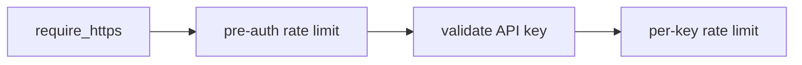

# Request pipeline — design notes (bas)

Converted from the Excalidraw board that used to live in this file. Four boxes, in the
order a request passes through them. Text is kept as written; where the code has
since moved on, a **Now:** line under the section says so.



## `require_https`

```
require_https(request) -> pass | 400
```

- middleware ตัวแรกสุด ก่อน preauth_rate_limit
- proto = request.header["X-Forwarded-Proto"]
  - ต้องมาจาก trusted proxy ที่เขียนทับ header เสมอ
  - ถ้า proxy ไม่เขียนทับ การตรวจนี้ปลอมได้
- if proto != "https" -> 400 immediately
- ห้าม redirect (request แรกพา key ไป plaintext แล้ว)
- ห้าม log header ใด ๆ ของ request นี้
- response: {"error": {"type": "invalid_request",
  "message": "HTTPS is required. Update your client to use https://"}}

**Now:** the message also tells the caller to revoke the key: _"HTTPS is required. Update your client to use https:// and revoke this key, as it was transmitted unencrypted."_ The body is the standard envelope (`error.code` / `error.message`), not `error.type`.

## Pre-auth rate limit

```
preauth_rate_limit(ip) -> {allowed, remaining, reset}
```

- ip มาจาก header ที่ trusted proxy เขียนทับเท่านั้น
  - ห้ามอ่าน X-Forwarded-For ตัวแรก (client กำหนดได้)
  - ใช้ X-Real-IP ถ้า nginx ตั้ง proxy_set_header ให้
  - ถ้าต้องใช้ XFF -> อ่านตัวขวาสุดหลัง trusted proxy hop
  - ห้าม key ด้วยค่าอื่นจาก request (User-Agent, custom header)
- bucket key: rl:ip:{ip}
- run token bucket lua (atomic)
  - refill by redis TIME, not app clock
  - cap 60 / refill 1 per sec / ttl 300
- redis down -> fail closed, 503
- deny -> 429 + RateLimit-* headers

## Validate API key

```
validate_api_key(token, source_ip) -> {user_id, key_id} | 401
```

- parse: mthw01_{key_id}_{secret}
  - wrong prefix or shape -> 401
  - key_id ต้องเป็น ULID ถูกรูป (26 ตัว, Crockford base32)
  - secret ต้องยาว 32 ตัว base62
  - ผิดรูป -> 401 ทันที ไม่แตะ redis ไม่แตะ db

- check negative cache: auth:neg:{key_id} -> 401

- hash = sha256(secret)
  - SHA-256 ไม่ใช่ bcrypt/argon2
  - secret มี entropy 190 bits จาก CSPRNG ไม่ใช่รหัสผ่าน
  - bcrypt ออกแบบให้ช้าเพื่อชดเชย entropy ต่ำ
  - ที่นี่ทำทุก request จึงรับต้นทุนนั้นไม่ได้

- raw token/secret ไม่ออกจาก scope ของฟังก์ชันนี้
  - ห้ามเก็บใน struct/object ที่ส่งต่อไป layer อื่น
  - ห้ามวางในตัวแปรที่อาจถูก serialize ลง error trace

- check auth cache: auth:{key_id}
  - cached value = {user_id, key_hash, status}
  - hit -> constant-time compare hash, check status
  - miss -> query db by key_id (db timeout 2s)

- db unavailable -> 503 ไม่ใช่ 401
  - 401 จะทำให้ผู้ใช้เข้าใจผิดว่า key ตัวเองเสีย

- db miss -> set auth:neg:{key_id} ttl 30 -> 401
  - cache เฉพาะ key_id ไม่มีจริง ไม่ cache กรณี hash ผิด
  - ttl 30 ไม่สั้นกว่า auth cache มากเกินไป (ลด timing gap)
  - หมายเหตุ: กันได้เฉพาะการยิงซ้ำ key เดิม
    ถ้ายิงด้วย key_id สุ่มไม่ซ้ำ ตัวที่กันคือ preauth_rate_limit

- constant-time compare hash

- status must be "active" (single source of truth, not revoked_at)

- user_id from key record only, never from request
  - ห้ามมี default user_id ทุกกรณี
  - cached value ไม่มี user_id -> ถือเป็น miss

- fill cache auth:{key_id} ttl 60
  - = worst-case exposure window หลัง revoke ถ้า invalidate พลาด

- on success -> update last_used_at (throttled 5 min)
  - คืน token กลับเข้า rl:ip:{ip}
  - IP bucket จึงนับเฉพาะ request ที่ล้มเหลว
  - ผู้ใช้ที่ตั้งค่า key ผิดชั่วคราวไม่ถูกกันหลังแก้ถูกแล้ว

- on failure -> audit: auth.failed (key_id, source_ip, reason) async
  - reason เก็บฝั่ง server เท่านั้น ไม่ส่งกลับให้ผู้เรียก
  - aggregate record ที่ซ้ำกัน (key_id + ip เดิม)
  - alert เมื่อ failure rate สูงผิดปกติจาก ip เดียว

- log ใช้ key_id เท่านั้น ห้าม log token/secret ทุกกรณี

- redis down -> 503, never fail open
  - Redis เป็น hard dependency ของ feature นี้
  - การถอยไป query db ทุก request จะทำให้ db ที่ใช้ร่วมกับ
    แอปหลักรับภาระเกิน กลายเป็นขยายผลกระทบไปสู่ระบบหลัก

- all failures return identical 401
  - เหมือนกันทั้ง status, body, header
  - ห้ามมี WWW-Authenticate ที่บอกเหตุผลต่างกัน
  - ห้ามมี error code ย่อยใน body

## Per-API-key rate limit

```
perkey_rate_limit(user_id, est_tokens) -> {allowed, remaining, reset, limit_type}
```

- user_id มาจาก validate_api_key เท่านั้น
  - ห้ามอ่านจาก request/header ทุกกรณี
- est_tokens = estimate_tokens(messages) + cap_tokens
  - ประมาณจากจำนวนตัวอักษร ไม่ต้องใช้ tokenizer จริง
  - ใช้เฉพาะ rate limit — quota reconcile ใช้ค่าจริงจาก provider
- est_tokens > MAX_INPUT_TOKENS -> 413 ก่อนแตะ bucket
- lua script เดียว รับ 2 KEYS ตรวจทั้งคู่ก่อนหัก ← เปลี่ยน
  - rl:key:{user_id} request count, cost 1
  - rl:tok:{user_id} llm token volume, cost est_tokens
  - ผ่านทั้งคู่ -> หักทั้งคู่
  - ตัวใดตัวหนึ่งไม่ผ่าน -> ไม่หักเลย + คืน limit_type ← เพิ่ม
- limit_type บอกว่า bucket ไหนปฏิเสธ (request | token)
- redis down -> fail closed, 503
- deny -> 429 + RateLimit-* headers
  - header แยกชุดตาม bucket ที่ปฏิเสธ

**Now:** the request bucket is `rl:req:{user_id}` (was `rl:key:{user_id}`). `limit_type` is `requests` | `tokens` and is carried in the 429 error code (`rate_limit_exceeded_requests` / `rate_limit_exceeded_tokens`). Both buckets are always reported: `RateLimit-*` for requests only, `X-RateLimit-Tokens-*` for tokens. Startup refuses a `MAX_INPUT_TOKENS` larger than the token bucket.
